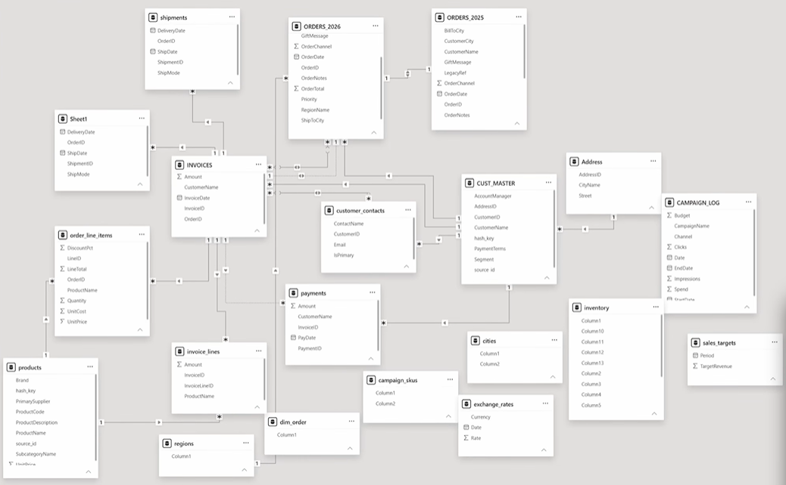
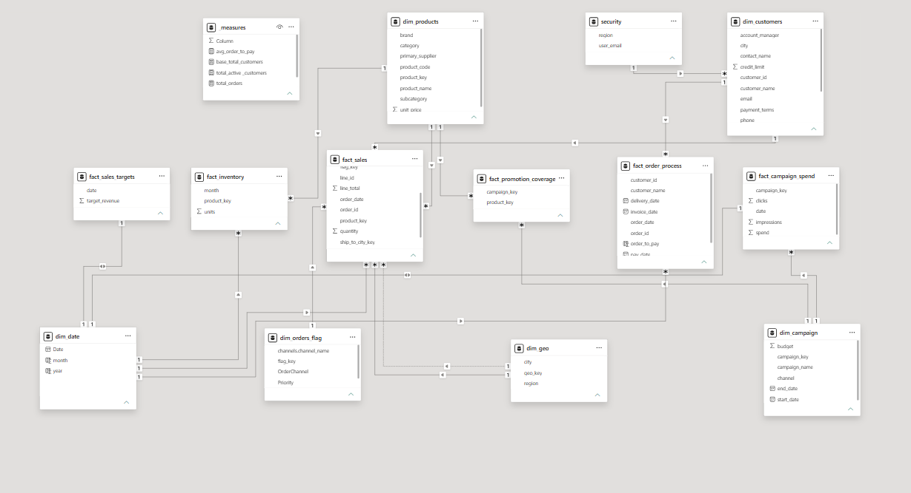

# Multi-Source Data Modelling in Power BI

Rebuilding a deliberately messy, multi-source business dataset into a clean, query-ready star schema in Power BI.

## Overview

This project takes 23 raw sheets (customers, orders, products, inventory, campaigns, invoices, payments and shipments, about 1,500 rows in total) and rebuilds them into a 13-table star schema: 6 fact tables, 6 dimension tables and 1 measures table. The focus is dimensional modelling and data preparation rather than dashboard design: resolving schema drift between source files, deduplicating overlapping tables, unpivoting wide data, splitting composite fields, and building the relationships, surrogate keys and DAX measures needed to make the model analysis-ready.

## Problems in the raw data

**Schema drift between periods.** ORDERS_2025 and ORDERS_2026 carry different columns (2025 includes LegacyRef, Status and SourceFile; 2026 does not), so the two years could not simply be stacked.

**Duplicate tables.** shipments and Sheet1 hold the same shipment fields under two different names.

**Wide-format data.** inventory stores twelve months of stock levels as twelve separate columns instead of a proper date attribute.

**Composite fields.** subcategories stores category and subcategory in one delimited string (for example "electronics|phones").

**Delimited many-to-many relationships.** campaign_skus lists every SKU a campaign promoted as one comma-separated text field, hiding a proper campaign-to-product relationship.

**Fragmented entities.** Customer, address, contact and credit-limit information is spread across four sheets (CUST_MASTER, Address, customer_contacts, user_details) with no single customer dimension.

## What was built

| Layer | Raw / source state | Modelled state |
| --- | --- | --- |
| Customers | CUST_MASTER, Address, customer_contacts, user_details and security: 4 separate sheets | dim_customers (consolidated) plus a security table wired for RLS by region |
| Products | products and subcategories (composite "category / subcategory" field) | dim_products with category and subcategory split into separate attributes |
| Orders | ORDERS_2025 and ORDERS_2026 with mismatched schemas | Reconciled into dim_orders_flag and fact_order_process |
| Fulfilment | shipments and Sheet1: duplicate schemas for the same data | Deduplicated into a single shipment / order-process record |
| Inventory | Wide format, one column per month (2025-01 to 2025-12) | fact_inventory, unpivoted to one row per product per month |
| Campaigns | campaign_skus: promoted SKUs in one delimited text field | fact_promotion_coverage, a bridge / factless-fact table linking campaign_key to product_key |
| Geography | cities and regions lookup sheets | dim_geo, a consolidated city / region hierarchy |
| Finance | INVOICES, payments, invoice_lines and order_line_items: 4 related sheets | Consolidated into fact_sales and fact_order_process (order-to-invoice-to-payment cycle) |

## Key modelling techniques

**Bridge / factless-fact table.** Converted the delimited SKU list in campaign_skus into fact_promotion_coverage, a proper many-to-many bridge between campaigns and products.

**Schema reconciliation across time periods.** Merged two years of order data with divergent column sets into one consistent fact / dimension structure.

**Unpivoting.** Transformed twelve monthly inventory columns into a date-attributed fact table.

**Row-level security.** Wired a dedicated security table (user email to region) to enforce region-based RLS on the model.

**Deduplication and entity consolidation.** Collapsed duplicate shipment sheets and fragmented customer sheets into single, authoritative dimensions.

**Composite field decomposition.** Split combined category / subcategory text into separate, filterable attributes.

**Surrogate keys.** Introduced clean key columns (product_key, customer_id, geo_key, campaign_key, flag_key) to drive relationships instead of source text fields.

## Final model

**Dimensions:** dim_products, dim_customers, dim_date, dim_geo, dim_campaign, dim_orders_flag

**Facts:** fact_sales, fact_inventory, fact_order_process, fact_campaign_spend, fact_promotion_coverage, fact_sales_targets

**Supporting:** a measures table (avg_order_to_pay, total_orders, total_active_customers, base_total_customers) and a security table driving row-level access by region

The model follows a star-schema layout with dimensions on the outside and facts at the centre, avoiding the many-to-many joins and duplicate sources present in the raw data.

## Before and after

Raw model:

Final star schema:

## Repository contents

**images/** holds the before and after model views.

**pbix/** holds the Power BI file (powerbi data modelling project.pbix).

## Tools used

Power BI Desktop (Power Query for transformation, DAX for measures, Model view for relationships and RLS) and Excel (source data review).
